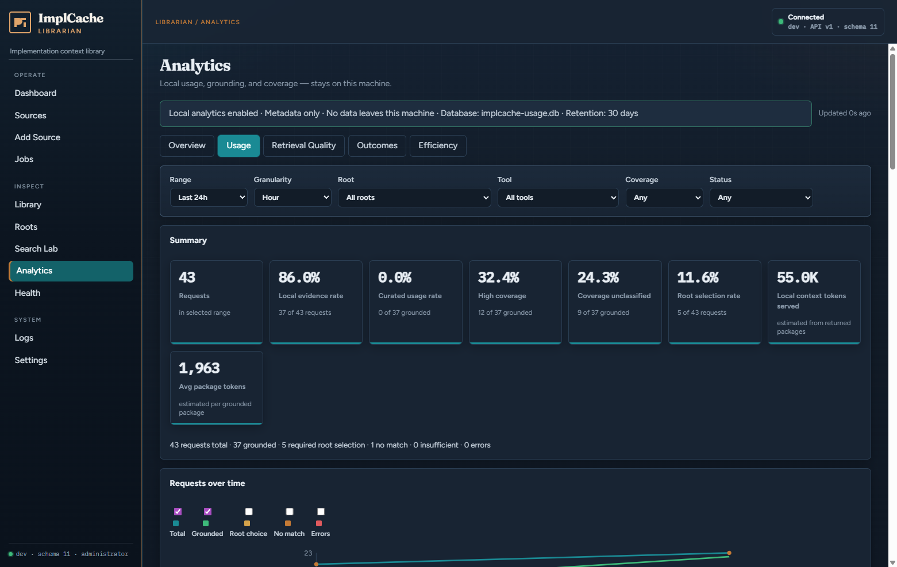
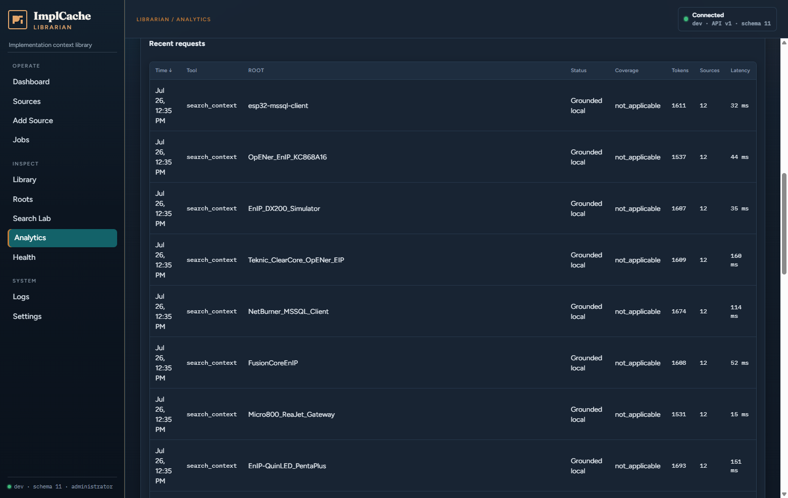
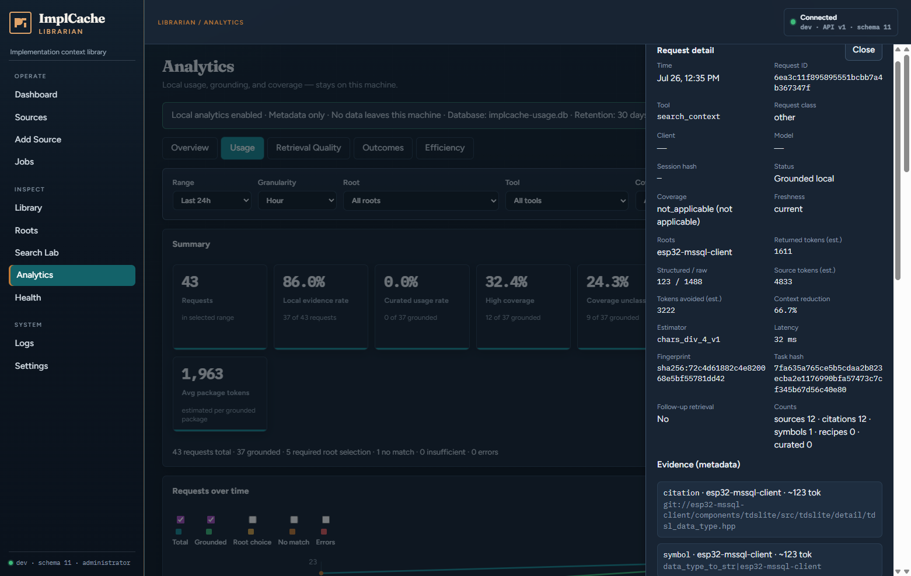
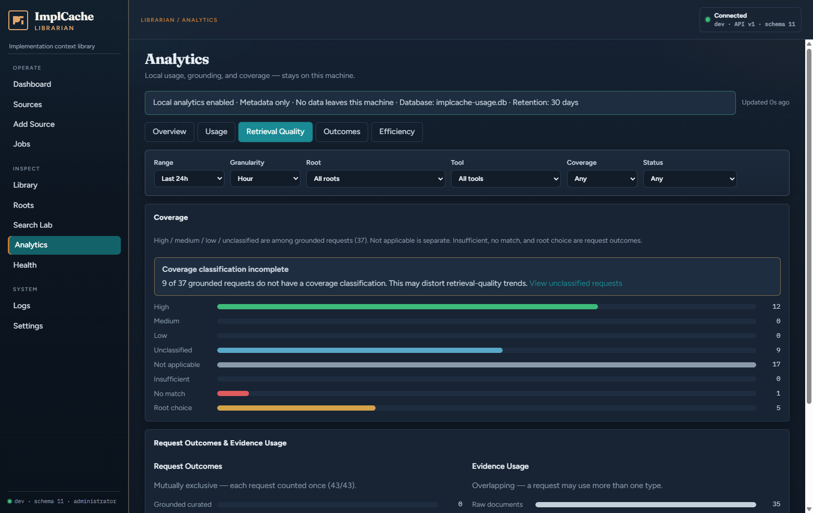
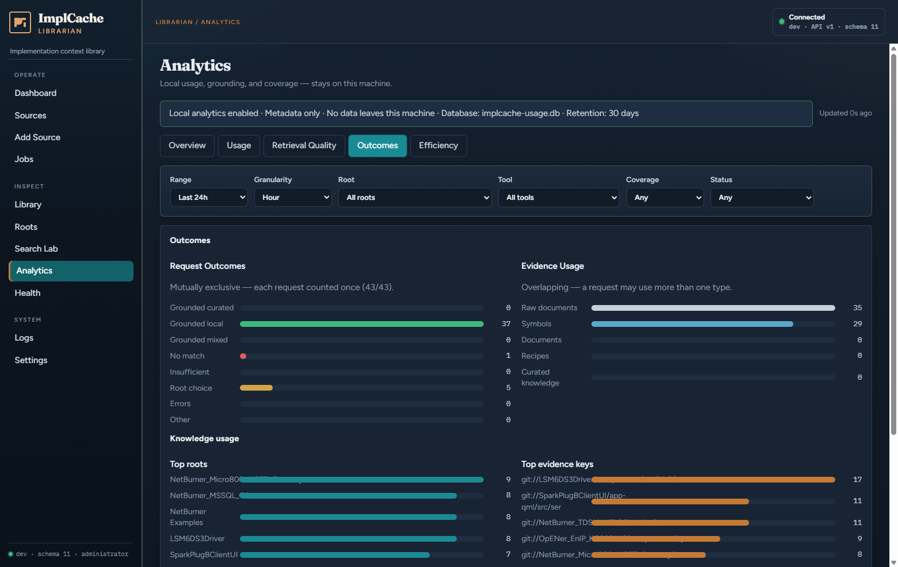
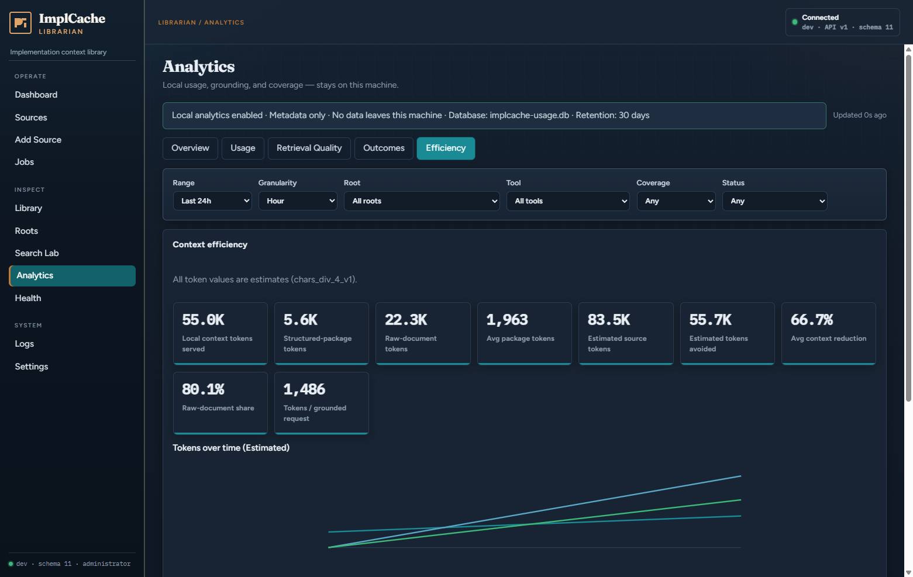
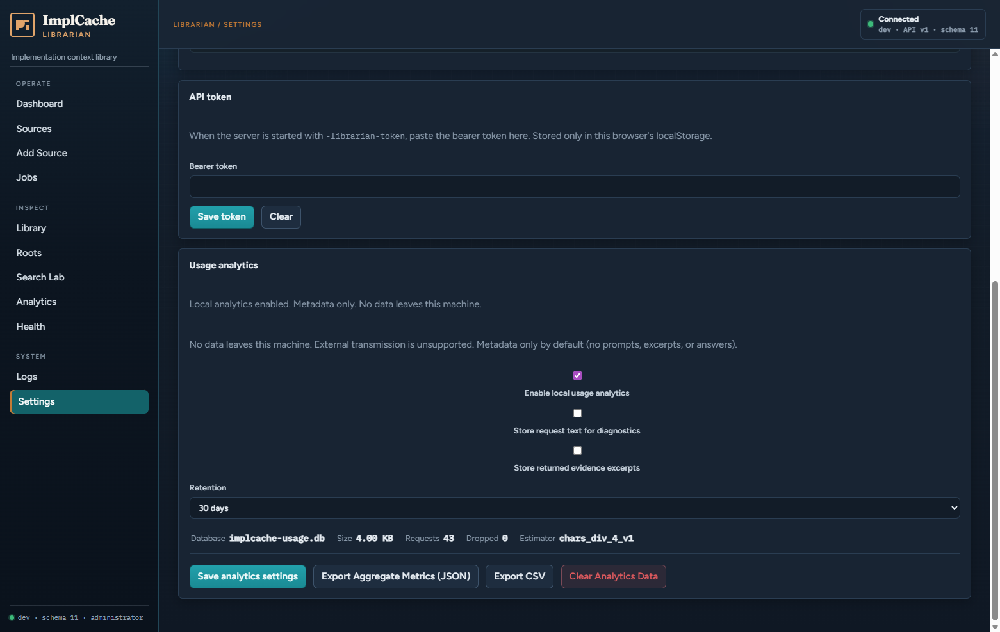

# Analytics dashboard — users guide

Local usage analytics show how ImplCache retrieval is used, whether packages are grounded in knowledge, how complete coverage looks, and how much context size is reduced versus estimated source material.

Everything stays on the machine. Analytics write to a **separate** SQLite file (`implcache-usage.db` by default), never into the knowledge database (`implcache.db`).

Related docs: [CONFIGURATION.md](CONFIGURATION.md#local-usage-analytics), [API_V1.md](API_V1.md#analytics-local-usage), [PRD_LOCAL_ANALYTICS.md](PRD_LOCAL_ANALYTICS.md).

---

## 1. Open the dashboard

1. Start the server with Librarian HTTP enabled, for example:

   ```bash
   implcache-mcp -db ./implcache.db -http 127.0.0.1:8080 -enable-librarian -enable-http-mutations -mode admin
   ```

2. Open **Inspect → Analytics** in the Librarian UI (`http://127.0.0.1:8080/analytics`), or use Search Lab / MCP / `POST /api/v1/search/context` to generate traffic first.

3. Confirm the green banner: analytics enabled, metadata-only, DB path, and retention.


If the banner says analytics are disabled or unavailable, fix Settings (below) or the `-usage-db` path / permissions. Retrieval still works when analytics cannot write.

---

## 2. Privacy and what is stored

| Default | Meaning |
|---------|---------|
| Metadata only | Tool name, status, roots, coverage, token estimates, hashes, latency — not full prompts or answers |
| Local only | No cloud export path; “external transmission” is unsupported |
| Separate DB | Clearing analytics never deletes indexed knowledge |

Optional diagnostics (off by default) can store request text or evidence excerpts. Keep those off unless you need them, and clear the usage DB when finished.

Token figures are **estimates** (`chars_div_4_v1`: UTF-8 rune length / 4). They are for relative comparison, not billing-grade counts.

---

## 3. Filters (all tabs)

Filters apply to every chart and table on the page.

| Control | Purpose |
|---------|---------|
| **Range** | Last 24h / 7d / 30d / 90d / All |
| **Granularity** | Hour / day / week / month (depends on range) |
| **Root** | Limit to one knowledge root |
| **Tool** | MCP or HTTP tool name (`get_implementation_context`, `search_context`, …) |
| **Coverage** | high / medium / low / unclassified / not_applicable |
| **Status** | grounded_*, root_selection_required, no_local_match, … |

URL query params keep the same filters (useful for bookmarks). Changing **Coverage → unclassified** and opening **Usage** is the usual path after a coverage warning.

---

## 4. Tabs at a glance

| Tab | What it answers |
|-----|-----------------|
| **Overview** | End-to-end picture: summary cards, time series, coverage, outcomes/evidence, recent requests |
| **Usage** | Volume and drill-down: summary, requests over time, sortable recent requests |
| **Retrieval Quality** | Coverage classification and outcome/evidence split |
| **Outcomes** | Exclusive request outcomes, overlapping evidence types, top roots / evidence keys |
| **Efficiency** | Token served/avoided, reduction %, package size, source-type breakdown |

---

## 5. Overview and Usage — summary cards



| Card | Meaning |
|------|---------|
| **Requests** | Count of analytics-tracked requests in the range |
| **Local evidence rate** | Share that returned local grounded evidence (curated / recipe / symbol / raw / mixed) |
| **Curated usage rate** | Among grounded requests, share that included reviewed curated knowledge |
| **High coverage** | Among grounded, share classified `high` |
| **Coverage unclassified** | Grounded requests that should have a coverage class but do not (shown when relevant) |
| **Root selection rate** | Share that stopped for ambiguous roots (`root_selection_required`) |
| **Local context tokens served** | Sum of estimated tokens in returned packages |
| **Avg package tokens** | Mean estimated package size for grounded context |

The reconcile line under the cards must add up: grounded + root choice + no match + insufficient + errors ≈ total. A mismatch surfaces a telemetry warning.

### Requests over time

Line chart of total / grounded / root choice / no match / errors. Toggle series with the checkboxes. Use finer **Granularity** on short ranges (e.g. Hour for 24h).

---

## 6. Recent requests and request detail



Columns: Time, Tool, Root, Status, Coverage, Tokens, Sources, Latency. Sort by column headers; paginate with Previous / Next.

Click a row to open **Request detail**:



| Field group | Contents |
|-------------|----------|
| Identity | Time, request ID, tool, client/model (if known), session/task hashes |
| Result | Status, coverage (+ not applicable), freshness, roots |
| Tokens | Returned, structured vs raw, estimated source, avoided, reduction %, estimator version |
| Counts | Sources, citations, symbols, recipes, curated |
| Evidence | Metadata rows: type, root, key/URI, per-item token estimate |

Close with **Close** or the backdrop. Full excerpts appear only if diagnostic storage was enabled when the event was recorded.

---

## 7. Retrieval Quality — coverage



Coverage describes how complete the **implementation package** looked for grounded requests:

| Class | Meaning |
|-------|---------|
| **High / medium / low** | Package completeness among grounded requests |
| **Unclassified** | Grounded but no coverage label recorded (can distort trends) |
| **Not applicable** | Coverage does not apply (e.g. some tools/status paths) |
| **Insufficient / No match / Root choice** | Shown for context; these are **outcomes**, not coverage grades |

If many grounded rows are unclassified, use **View unclassified requests** (sets Coverage filter and jumps toward Usage).

The same tab repeats **Request Outcomes** (exclusive) and **Evidence Usage** (overlapping).

---

## 8. Outcomes and knowledge usage



### Request Outcomes (mutually exclusive)

Each request is counted once:

| Outcome | Meaning |
|---------|---------|
| Grounded curated | Local evidence including curated knowledge |
| Grounded local | Local evidence without curated |
| Grounded mixed | Mixed grounding classes |
| No match | Nothing useful found locally |
| Insufficient | Local hit but package too thin |
| Root choice | Caller must pick a root |
| Errors | Request failed |
| Other | Residual / unclassified status |

### Evidence Usage (overlapping)

A single request can use several evidence kinds: raw documents, symbols, documents, recipes, curated knowledge.

### Knowledge usage

- **Top roots** — which corpora were selected most often  
- **Top evidence keys** — which URIs / symbol keys appeared most often  

Use these to see which corpora agents lean on and which files dominate citations.

---

## 9. Efficiency — context reduction



| Metric | Meaning |
|--------|---------|
| **Local context tokens served** | Estimated tokens in packages returned to the client |
| **Structured-package tokens** | Symbols/APIs and structured package fields |
| **Raw-document tokens** | Citation / document excerpt share |
| **Avg package tokens** | Mean package size |
| **Estimated source tokens** | Estimated size of underlying source material considered |
| **Estimated tokens avoided** | Rough “not dumped into context” savings |
| **Avg context reduction** | Average reduction percentage across eligible packages |
| **Raw-document share** | Fraction of attributed evidence that is raw document material |
| **Tokens / grounded request** | Served tokens ÷ grounded requests |
| **Tokens / successful outcome** | Only appears when implementation **outcome_events** exist (success/implemented). Hidden until something reports outcomes. |

Charts:

- **Tokens over time** — served / source / avoided series  
- **Average package size & reduction** — package size and reduction % over time  
- **Source-type breakdown** — citation vs symbol vs mixed overhead attribution  

Interpret reduction as a **relative efficiency signal**, not a guarantee of model cost savings.

---

## 10. Settings — enable, retain, export, clear

Open **System → Settings → Usage analytics**.



| Control | Effect |
|---------|--------|
| **Enable local usage analytics** | Stop/start new writes; existing data remains until cleared |
| **Store request text for diagnostics** | Optional; may capture sensitive task text |
| **Store returned evidence excerpts** | Optional; may capture source snippets |
| **Retention** | Auto-purge older events (30–365 days or unlimited) |
| **Save analytics settings** | Persist the above |
| **Export Aggregate Metrics (JSON/CSV)** | Download aggregates for the current filter range (no full prompt dumps) |
| **Clear Analytics Data** | Wipe the usage DB (knowledge DB untouched); confirmation required |

Status row: DB path, file size, request count, dropped write count, estimator version.

### CLI / env equivalents

| Flag / env | Role |
|------------|------|
| `-telemetry=local\|off` / `IMPLCACHE_TELEMETRY` | Master on/off |
| `-usage-db` / `IMPLCACHE_USAGE_DB` | Usage DB path |
| `-telemetry-retention-days` | Retention |

---

## 11. How data is produced

Analytics update when retrieval runs through:

- MCP tools (`get_implementation_context`, `search_knowledge`, `find_symbol`, …)
- Librarian Search Lab
- HTTP `POST /api/v1/search/context` (and related search routes)

Prefer a **single** `projectRoot` (or resolved root) for grounded packages. Ambiguous multi-root queries often become `root_selection_required` and will not look like grounded success.

HTTP Analytics APIs used by the UI are documented in [API_V1.md](API_V1.md#analytics-local-usage).

---

## 12. Reading the numbers (worked example)

From a short local session (Last 24h in the screenshots):

| Signal | Example | Interpretation |
|--------|---------|----------------|
| Local evidence rate | ~86% | Most requests returned local evidence |
| Root selection rate | ~12% | Some calls needed an explicit root |
| Avg context reduction | ~66.7% | Packages much smaller than estimated source |
| Raw-document share | ~80% | Evidence mix still citation-heavy vs structured symbols |
| Coverage unclassified | ~24% of grounded | Quality charts need care until more rows are classified |

---

## 13. Troubleshooting

| Symptom | What to check |
|---------|----------------|
| Empty dashboard | Generate traffic; confirm Enable analytics; wait for refresh (“Updated Ns ago”) |
| Banner: disabled | Settings → enable, or `-telemetry=local` |
| Banner: unavailable | Path/permissions for `-usage-db`; disk space |
| High root selection | Pass `projectRoot` / choose from `availableRoots` |
| Efficiency cards missing structured/raw | Older events before v2 token fields; new grounded requests fill them |
| Tokens / successful outcome missing | Nothing writes `outcome_events` yet — expected |
| Unclassified coverage warning | Filter Coverage=unclassified; inspect tools/status in request detail |
| Cursor MCP vs WebUI counts differ | Separate processes may use different DBs or only one path records — use the WebUI DB path shown in the banner |

---

## 14. Screenshot index

See [images/analytics/README.md](images/analytics/README.md).
