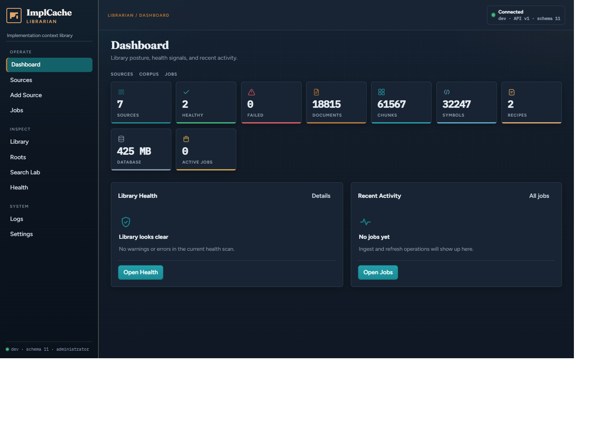
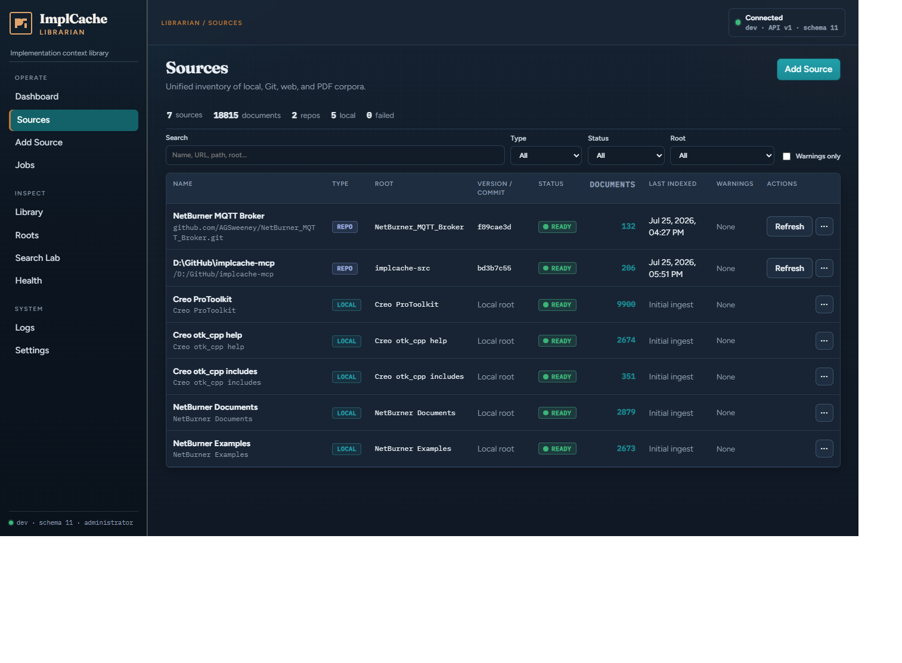
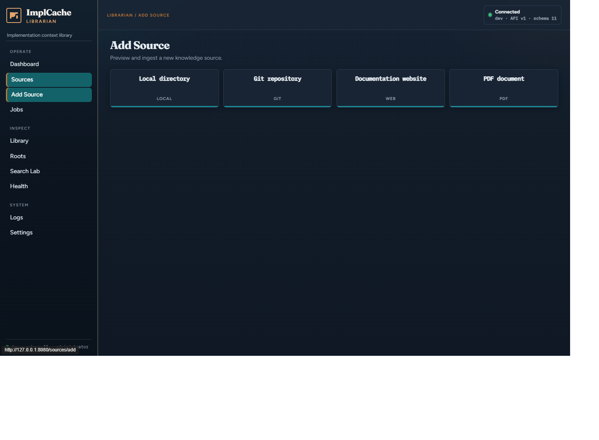
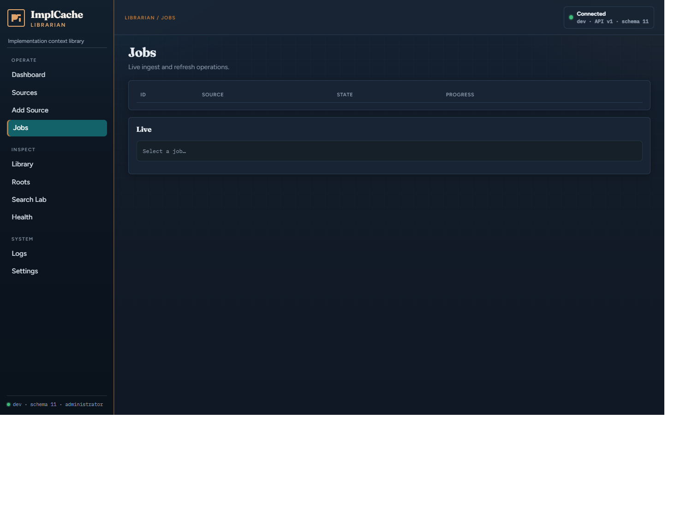
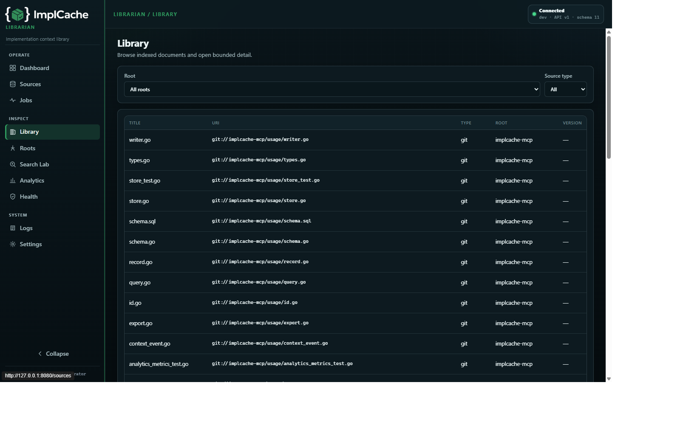
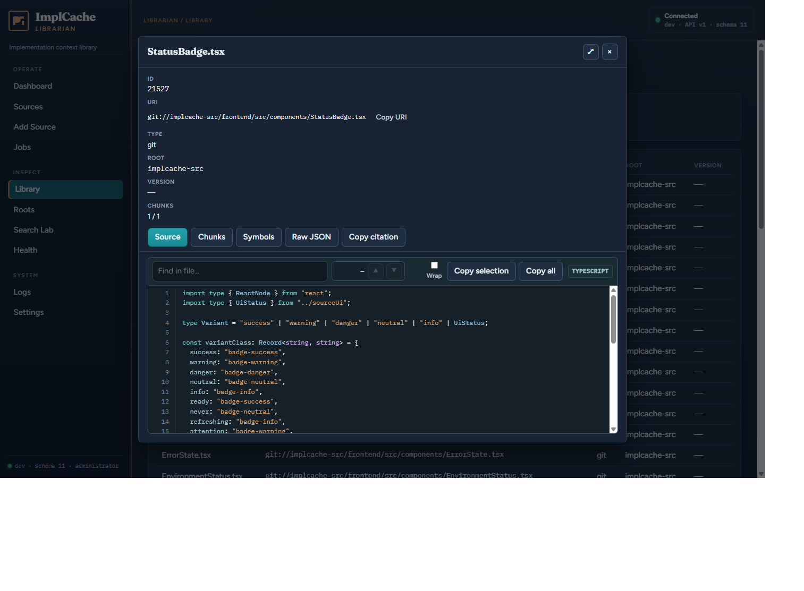
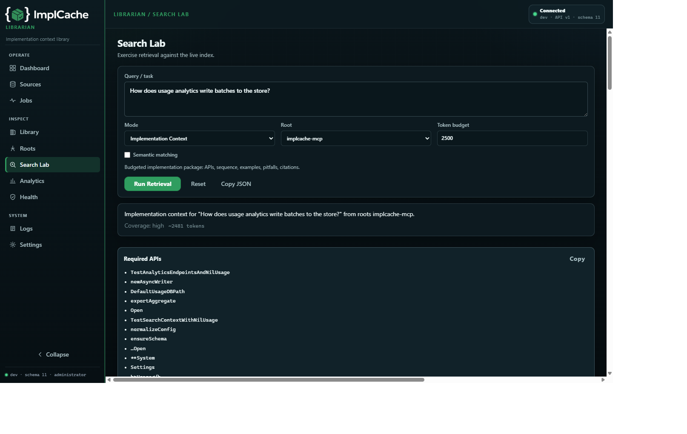
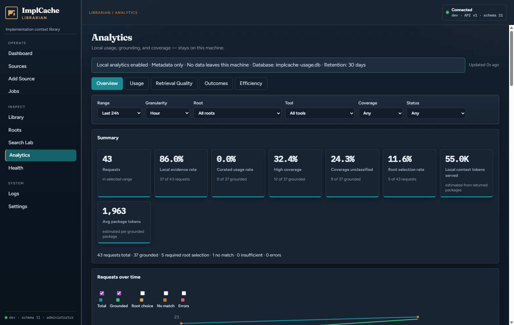
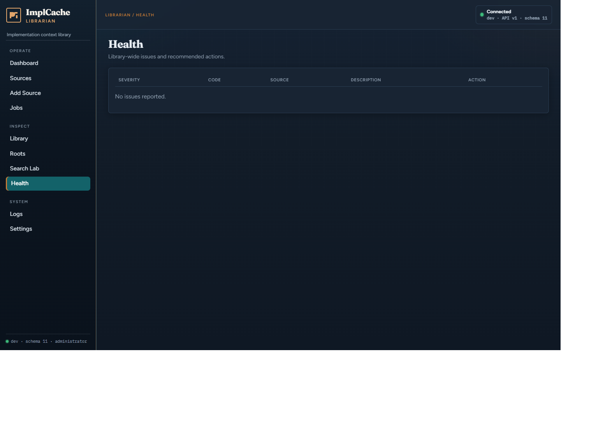

# ImplCache MCP — Users Manual

This manual is the operator entry point for ImplCache MCP: install, ingest, Cursor setup, Librarian, daily maintenance, and how coding agents should use the tools.

Deep-dive references stay in sibling docs ([TOOLS.md](TOOLS.md), [INGEST.md](INGEST.md), [API_V1.md](API_V1.md), and others). Use this manual to get a working system; follow links when you need exhaustive parameter tables.

---

## 1. Introduction

ImplCache MCP is a **local, SQLite-backed implementation-context server** for coding agents. It indexes technical documentation, source trees, web mirrors, PDFs, and Git repositories, then returns a **budgeted, cited package** of APIs, sequences, examples, constraints, and pitfalls—not a dump of search hits.

> Return the smallest sufficient package of accurate, implementation-ready context for the current coding task.

**Who it is for**

| Role | Typical use |
|------|-------------|
| Operator | Build the binary, ingest corpora, configure Cursor / Librarian |
| Coding agent | Call retrieval tools (default `-mode agent`) to implement tasks correctly |
| Maintainer | Admin tools, REST, and UI for inventory, crawl, refresh, health |

**Status (pre-1.0)**

- Schema identity: `PRAGMA user_version = 12`. Version 11→12 migrates knowledge-group columns only; other incompatible DBs are refused—delete and re-ingest.
- Tool contracts and ranking can still evolve.
- License: MIT. Module `implcache-mcp`, **Go 1.25+**, pure-Go SQLite (`modernc.org/sqlite`; no CGO for normal builds).

---

## 2. Concepts

### Knowledge roots

A **root** (`rootName`) is a stable corpus id, e.g. `my_app`, `example-device-sdk`. A **knowledge group** (`knowledgeGroup`, e.g. `netburner`) is an explicit trusted family of related roots (docs, examples, projects) that may be searched together. Ambiguous queries that span **unrelated groups** return `needsChoice` + `availableRoots` / `availableGroups`—ask the user; do not guess across groups.

### Portable URIs

Documents use machine-portable URIs (filesystem paths are not baked into the URI):

```text
project://{rootName}/{relative/path}   # markdown, HTML, project, web pages
pdf://{rootName}/{file}                # PDF Stage 1
git://{rootName}/{relative/path}       # Git-acquired trees (commit-pinned)
```

### Authority ranking (high → low)

| Authority | Meaning |
|-----------|---------|
| `current_project` | Active application code |
| `related_internal_project` | Related internal code |
| `curated_internal_recipe` | Human-reviewed recipe |
| `official_example` | Official sample |
| `official_documentation` | Vendor/official docs |
| `generated_summary` | e.g. `vomit` / `saveRecipe` output |
| `third_party_reference` / `unknown` | Lowest / unclassified |

**Freshness** (`current`, `version-specific`, `mixed`, `stale`, `unknown`) is independent of authority.

### Agent vs admin mode

| Mode | Flag | Tools |
|------|------|-------|
| **agent** (default) | `-mode agent` | Retrieval only: `get_implementation_context`, `find_symbol`, `search_knowledge`, `get_document`, `list_roots` |
| **admin** | `-mode admin` or `-enable-admin-tools` | Agent tools + ingest, delete, web/PDF/Git, Librarian MCP tools, `vomit` |

Permission flags (`-readonly`, `-allow-ingest`, …) still apply when admin schemas are registered. Details: [MODES.md](MODES.md).

### Configuration sources

Configuration is primarily flags and an optional workspace manifest. Analytics also accepts `IMPLCACHE_TELEMETRY` and `IMPLCACHE_USAGE_DB`. Configuration is:

1. **CLI flags** on `implcache-mcp` / `ingestcli`
2. Optional **`.implcache.yaml`** via `-workspace DIR`

Shell variables in ops examples (e.g. `$ADMIN_TOKEN`) are only values you pass into flags.

---

## 3. Install and build

**Requirements:** Go 1.25+.

```bash
go test ./...
go build -ldflags "-X main.version=$(git describe --tags --always 2>/dev/null || echo dev)" -o implcache-mcp .
go build -o ingestcli ./cmd/ingestcli
```

On Windows PowerShell, adjust quoting for `-ldflags` as needed, or omit it (reported version stays `dev`).

```bash
./implcache-mcp -version
```

SQLite is pure Go; **no CGO** required for normal build/test. Race detection (`go test -race`) needs a gcc-compatible toolchain—see [OPERATIONS.md](OPERATIONS.md).

Do not commit `*.db` or large vendor corpora (see `.gitignore`).

---

## 4. Quick start — agent install

Goal: a retrieval-only MCP server for Cursor, with at least one ingested root.

### 4.1 Build and create a database

```bash
go build -o implcache-mcp .
go build -o ingestcli ./cmd/ingestcli
```

Opening the DB on first run creates schema version 11.

### 4.2 Ingest a small corpus (CLI)

Prefer `ingestcli` so MCP sessions stay responsive:

```bash
# Vendor / help docs (Markdown or HTML)
./ingestcli -db ./implcache.db -mode markdown -root example-device-sdk -path /path/to/docs

# Your application sources
./ingestcli -db ./implcache.db -mode project -root my_app -path /path/to/src
```

Confirm roots later with the agent tool `list_roots`, or:

```bash
./implcache-mcp -db ./implcache.db -mode admin
# then call list_roots / list_documents via MCP
```

### 4.3 Optional workspace manifest

At a repo root, add `.implcache.yaml` so the server supplies default `projectRoot` / preferred roots:

```yaml
rootName: my_app
technology:
  - Example Device SDK
languages:
  - cpp
authority: current_project
relatedRoots:
  - example-device-sdk
```

See [MANIFEST.md](MANIFEST.md).

### 4.4 Cursor MCP config

Use **absolute paths**. Default agent mode is retrieval-only:

```json
{
  "mcpServers": {
    "implcache": {
      "command": "D:/Tools/ImplCache/implcache-mcp.exe",
      "args": [
        "-db", "D:/Tools/ImplCache/implcache.db",
        "-mode", "agent",
        "-workspace", "D:/work/my_app"
      ]
    }
  }
}
```

Reload the MCP server in Cursor after rebuilding the binary.

**Remote host (e.g. Jetson Orin NX on the LAN):** run ImplCache with `-http`, `-allow-remote-http`, and Librarian as needed, then add a second MCP entry that uses a URL instead of a local command:

```json
"implCacheRemote": {
  "url": "http://172.16.82.121:8080/mcp"
}
```

Full Jetson/LAN guide: [REMOTE.md](REMOTE.md).

### 4.5 First retrieval

Have the agent call:

```json
{
  "task": "register a menubar pushbutton using the device SDK",
  "language": "c",
  "technology": "example-device-sdk",
  "preferredRoots": ["my_app", "example-device-sdk"],
  "maxContextTokens": 2500
}
```

Implement from `requiredApis`, `sequence`, `examples`, and `citations`. Full agent loop: [AGENT_GUIDE.md](AGENT_GUIDE.md) and [§8](#8-using-with-coding-agents).

---

## 5. Quick start — Librarian / admin

Goal: browser UI + REST for corpus inventory, crawl, PDF/Git ingest, and search playground.

```bash
./implcache-mcp -db ./implcache.db -http :8080 \
  -enable-librarian -enable-http-mutations -mode admin
```

Open `http://127.0.0.1:8080/`.

Shared or reverse-proxied deployment (keep Go on loopback; terminate TLS at the proxy):

```bash
./implcache-mcp -db ./implcache.db -http 127.0.0.1:8080 \
  -enable-librarian -enable-http-mutations -mode admin \
  -librarian-token "$ADMIN_TOKEN" \
  -librarian-viewer-token "$VIEWER_TOKEN"
```

| Flag | Role |
|------|------|
| `-librarian-token` | Administrator (mutating `/api/v1`) |
| `-librarian-viewer-token` | Viewer (reads + search; mutations → 403) |

Send `Authorization: Bearer <token>`. SSE job streams may use `?access_token=` when headers are unavailable. If neither token is set, `/api/v1` is open (intended for loopback).

**MCP over HTTP** is at `/mcp` (same tool surface as stdio). It does not use Librarian Bearer tokens; protect exposure with bind address, mutation flags, and a reverse proxy.

Without `-enable-librarian`, `/` explains that the UI is disabled; `/api/v1` may still be mounted under the HTTP handler tree—see [API_V1.md](API_V1.md).

---

## 6. Configuration reference

### 6.1 Server flags (`implcache-mcp`)

| Flag | Default | Purpose |
|------|---------|---------|
| `-db` | `./implcache.db` | SQLite path |
| `-http` | _(empty = stdio)_ | Serve HTTP: MCP at `/mcp`, Librarian at `/api/v1` |
| `-mode` | `agent` | `agent` (retrieval) or `admin` (ingest/delete/vomit + more) |
| `-enable-admin-tools` | `false` | Register admin tools even when `-mode=agent` |
| `-readonly` | `false` | Disable ingest/delete/vomit file writes; open DB read-only when possible |
| `-allow-ingest` | `true` | Gate ingest when admin tools are enabled |
| `-allow-delete` | `true` | Gate delete when admin tools are enabled |
| `-allow-output-write` | `true` | Gate `vomit` filesystem writes |
| `-enable-http-mutations` | `false` | Allow ingest/delete/writes over HTTP (off by default) |
| `-allow-remote-http` | `false` | Allow non-loopback HTTP bind |
| `-enable-librarian` | `false` | Serve Librarian UI + `/api/v1` (**requires `-http`**) |
| `-librarian-base-path` | `/` | URL base for embedded UI |
| `-librarian-token` | _(none)_ | Bearer admin token for `/api/v1` |
| `-librarian-viewer-token` | _(none)_ | Bearer viewer (read-only) token for `/api/v1` |
| `-upload-dir` | `<db-dir>/uploads` | Librarian upload directory |
| `-workspace` | _(none)_ | Load `DIR/.implcache.yaml` for default roots |
| `-project-root` | _(none)_ | Default `projectRoot` (overrides manifest `rootName`) |
| `-output-root` | `./vomit-output` | Jail for `vomit` output paths |
| `-max-results` | `20` | Search result cap |
| `-max-ingest-files` | `50000` | Per-ingest file cap |
| `-max-document-bytes` | `8 MiB` | Per-file size cap |
| `-enable-semantic` | `false` | Sparse term-vector similarity (not embeddings) |
| `-version` | | Print version and exit |

### 6.2 HTTP safety defaults

- Bare `:port`, `0.0.0.0`, or `::` is rewritten to `127.0.0.1`
- Non-loopback binds require `-allow-remote-http`
- HTTP without `-enable-http-mutations` clears mutation permissions (even if admin/Librarian is enabled)
- Header/idle timeouts and graceful SIGINT/SIGTERM shutdown apply
- Security headers (CSP, frame denial, etc.) are set on Librarian responses

### 6.3 Workspace manifest

Loaded with `-workspace DIR`. Required field: `rootName`. Optional: `technology`, `languages`, `authority`, `relatedRoots`, `versions`. Full rules: [MANIFEST.md](MANIFEST.md).

### 6.4 Recommended profiles

```bash
# Cursor agent (stdio, retrieval only)
./implcache-mcp -db ./implcache.db -mode agent -workspace ./my_app

# Local admin MCP (mutations via tools)
./implcache-mcp -db ./implcache.db -mode admin

# Read-only production-ish agent
./implcache-mcp -db ./implcache.db -mode agent -readonly

# Librarian with mutations on loopback
./implcache-mcp -db ./implcache.db -http :8080 \
  -enable-librarian -enable-http-mutations -mode admin
```

---

## 7. Ingesting knowledge

Unchanged content is skipped via content hash. Cap defaults: 50 000 files per operation, 8 MiB per file.

### 7.1 Choose a pipeline

| Content | Mechanism | `source_type` / URI |
|---------|-----------|---------------------|
| Markdown / HTML trees | `ingestcli -mode markdown` or `ingest_markdown` | `markdown` / `project://…` |
| Application source | `ingestcli -mode project` or `ingest_project` | `source` / `project://…` |
| Single doc URL | `ingestcli -mode url` or `ingest_url` | `web` / `project://…` |
| Site crawl | Admin `add_web_source` + `ingest_site`, or Librarian REST/UI | `web` (**not** in ingestcli yet) |
| PDF (local text) | `pdf-ingest` / `ingest_pdf` | `pdf` / `pdf://…` (OCR deferred) |
| Git tree | `repo-ingest` / `ingest_repo` | `git` / `git://…` (system `git`; no secrets in DB) |

Prefer **`ingestcli`** for large trees. Full flag tables and tips: [INGEST.md](INGEST.md).

Repos with a conventional `LibraryDocs/` package are detected during git/project ingest (`auto` by default; see [LibraryDocs-aware ingest](INGEST.md#librarydocs-aware-ingest) and [LIBRARYDOCS.md](LIBRARYDOCS.md)). Handling can be set via ingest options or `.implcache.yaml` `libraryDocsHandling` (`auto` \| `normal` \| `exclude`); change requires reindex.

To **build** those packages in a source repo, install the create-librarydocs Cursor skill from [`tools/create-librarydocs.zip`](../tools/create-librarydocs.zip) (or the unpacked [`tools/create-librarydocs/`](../tools/create-librarydocs/) tree). Overview: [CREATE_LIBRARYDOCS.md](CREATE_LIBRARYDOCS.md).

### 7.2 Root naming

Use stable ids (`example-device-sdk`, `my_app`). Never mix unrelated product families into one root. Ingest project code as its own root so ranking can prefer `current_project`.

### 7.3 Example CLI session

```bash
./ingestcli -db ./implcache.db -mode markdown -root example-device-sdk -path "C:/sdk/help"
./ingestcli -db ./implcache.db -mode project -root my_app -path "D:/work/my_app"
./ingestcli -db ./implcache.db -mode url -root esp-idf-docs \
  -url "https://docs.example.com/en/latest/api.html" -profile sphinx
./ingestcli -db ./implcache.db -mode pdf-ingest -root manuals -path ./manual.pdf
./ingestcli -db ./implcache.db -mode repo-ingest -name sdk -root sdk-main \
  -url https://github.com/org/sdk.git -ref main -acq managed_clone
```

Managed Git clones live under `<db-dir>/.implcache/repos/` (gitignored).

### 7.4 Symbols

Ingest extracts symbols for Go, C/C++/C#, Python, JS/TS, and Java (heuristic; ~80 symbols/file cap). Unknown languages do not get noisy fallback extractors.

---

## 8. Using with coding agents

### 8.1 Default loop

```text
1. Identify: task, language, technology, project
2. Call get_implementation_context (+ preferredRoots when known)
3. Write code from the package (APIs, sequence, examples, pitfalls)
4. Only if stuck:
     find_symbol → search_knowledge → get_document(includeBody)
5. Avoid opening many Markdown files or web-searching first
```

### 8.2 Agent tools (cheat sheet)

| Tool | When to use |
|------|-------------|
| **`get_implementation_context`** | First call for any coding task |
| **`find_symbol`** | Exact/near-exact named API / type |
| **`search_knowledge`** | Broader FTS exploration in a known root |
| **`get_document`** | Full body of one cited URI |
| **`list_roots`** | Discover what is ingested |

Do **not** start with high-limit `search_knowledge` or `get_document` on every hit. Full schemas: [TOOLS.md](TOOLS.md). Broader guidance: [AGENT_GUIDE.md](AGENT_GUIDE.md).

### 8.3 Reading the package

Treat as authoritative for local knowledge: `requiredApis`, `sequence`, `examples`, `constraints`, `pitfalls`, `citations`. Watch `coverage`, `freshness`, and `webSearchRecommended`. `estimatedTokens` is approximate (`utf8_runes/4`).

### 8.4 `needsChoice`

If a tool returns `needsChoice` / `availableRoots`:

1. Ask the user which corpus applies  
2. Retry with `rootName` or `preferredRoots`  
3. Do not merge unrelated product families  

### 8.5 Optional semantic search

`-enable-semantic` (or per-call `semantic: true`) supplements FTS with IDF-weighted sparse cosine over term postings. It is **not** neural embeddings. Default remains FTS-only.

### 8.6 Anti-patterns

- Searching all roots with a vague query and mixing results  
- Requesting full bodies for every search hit  
- Treating generated recipes as more authoritative than project code  
- Ignoring `needsChoice`  
- Guessing vendor version notes when `freshness` is `unknown`  

---

## 9. Librarian UI and REST

Enable with `-http` + `-enable-librarian` (usually also `-enable-http-mutations -mode admin`).

**UI pages** (embedded SPA; no Node.js at runtime): Dashboard, Sources, Add Source, Jobs, Library, Roots, Search Lab, Analytics, Health, Logs, Settings.

Production assets live in `embedui/dist`. Optional rebuild: see [frontend/README.md](../frontend/README.md).

**Analytics** (local usage, grounding, coverage, efficiency): see the full walkthrough with screenshots in [ANALYTICS_USERS_GUIDE.md](ANALYTICS_USERS_GUIDE.md).

### Screenshots

| Page | Preview |
|------|---------|
| Dashboard |  |
| Sources |  |
| Add Source |  |
| Jobs |  |
| Library |  |
| Document viewer |  |
| Search Lab |  |
| Analytics |  |
| Health |  |

**REST** base: `http://127.0.0.1:8080/api/v1`

| Area | Examples |
|------|----------|
| Capability | `GET /server` |
| Sources | list/get/health; web/git/pdf/local ingest, refresh, delete |
| Jobs | list/get, SSE events, cancel (**process-local**) |
| Library | stats, documents, symbols |
| Roots | roots, root-groups CRUD |
| Search | playground, symbols, implementation context |
| Health / logs | library health, in-process log ring |

Auth, error envelope, and full route catalog: [API_V1.md](API_V1.md).

Jobs survive browser reload while the process lives; they do **not** survive server restart.

---

## 10. Recipes and `vomit`

`vomit` (admin-only) compiles a longer, source-grounded Markdown playbook from the local KB.

| Use | Avoid |
|-----|--------|
| Durable playbooks you will reuse | Every small edit |
| Optional disk write under `-output-root` | Paths outside the output jail |
| `saveRecipe` to persist a **generated** knowledge entry | Treating generated entries as curated truth |

Generated recipes keep source lineage and rank **below** human-reviewed recipes and project code. After a recipe proves correct, mark it `human_reviewed` in the DB via your ops process (outside the default agent loop).

---

## 11. Operations and maintenance

### Typical ops loop

1. Build `implcache-mcp` + `ingestcli`  
2. Ingest docs and project roots (CLI preferred for large trees)  
3. Configure Cursor MCP with absolute `-db` paths (`-mode agent`)  
4. Agents call `get_implementation_context`  
5. Optionally `vomit` + human-review high-value recipes  
6. Re-ingest when vendor docs or project code change (hash skip makes repeats cheap)  
7. Rebuild + **reload MCP** after binary changes  

### Maintenance actions

| Task | How |
|------|-----|
| Delete one document | `delete_document` / REST library APIs |
| Delete by URI prefix | `delete_by_uri_prefix` / `ingestcli -mode delete-prefix` |
| List inventory | `list_roots`, `list_documents`, `list_*_sources`, Librarian Sources |
| Refresh web / git | `refresh_web_source`, `refresh_repo_source` (or UI) |
| Remove PDF / repo / local root | matching remove tools or REST `DELETE` |
| Health | `source_health`, `GET /health` |
| Logs | `GET /logs` (ring buffer) |

### Read-only profile

```bash
./implcache-mcp -db ./implcache.db -readonly
# or finer gates:
./implcache-mcp -db ./implcache.db \
  -allow-ingest=false -allow-delete=false -allow-output-write=false
```

### Database files

| File | Role |
|------|------|
| `implcache.db` | Main SQLite DB |
| `implcache.db-wal` / `-shm` | WAL sidecars when present |

SQLite WAL is fine for concurrent readers; prefer a **single writer** process for ingest. More ops detail: [OPERATIONS.md](OPERATIONS.md).

---

## 12. Troubleshooting

| Symptom | What to check |
|---------|----------------|
| Schema / open refused | Wrong `user_version`; delete DB (+ wal/shm) and re-ingest |
| Tools missing / old behavior | Reload MCP; confirm exe path and mtime |
| Empty search | `list_roots`; re-ingest; verify `-db` path matches Cursor config |
| `needsChoice` | Ask user; pass `rootName` / `preferredRoots` |
| Ingest denied | Not `-readonly`; `-allow-ingest=true`; admin mode or `-enable-admin-tools` |
| HTTP mutations denied | Pass `-enable-http-mutations`; check viewer vs admin token |
| HTTP bind refused | Non-loopback needs `-allow-remote-http`; bare `:port` rewrites to loopback |
| Librarian UI 404 / disabled | Need `-http` and `-enable-librarian` |
| Vomit write fails | Relative path under `-output-root`; `-allow-output-write` |
| DB locked | Stop other ingest/MCP writers; one writer at a time |
| Agent inventing APIs | Prefer `get_implementation_context` + `find_symbol`; check `coverage` / `webSearchRecommended` |

---

## 13. Limitations and risks

Short summary (full table in [OPERATIONS.md § Limitations and risks](OPERATIONS.md#limitations-and-risks)):

- Pre-1.0: schema and contracts may change; pin or vendor if you need stability  
- Symbol extraction is heuristic; optional sparse semantic ≠ embeddings  
- Web crawl: no JS browser rendering; SSRF-safe fetch; authenticated portals deferred  
- PDF Stage 1: local text only; OCR deferred  
- Git: system `git`, external credentials only  
- `estimatedTokens` is approximate  
- Librarian jobs are process-local  
- Recipe quality depends on human review  
- Requires **Go 1.25+**  

---

## 14. Appendix

### 14.1 What to read next

| Document | Contents |
|----------|----------|
| [AGENT_GUIDE.md](AGENT_GUIDE.md) | Agent loop and anti-patterns |
| [TOOLS.md](TOOLS.md) | Full MCP tool reference + permission matrix |
| [MODES.md](MODES.md) | Agent/admin surfaces, HTTP safety |
| [INGEST.md](INGEST.md) | All ingest modes + ingestcli flags |
| [API_V1.md](API_V1.md) | Librarian REST + auth |
| [OPERATIONS.md](OPERATIONS.md) | Build, security, validation, evaluation |
| [MANIFEST.md](MANIFEST.md) | `.implcache.yaml` |
| [DATA_MODEL.md](DATA_MODEL.md) | URIs, schema, authority, recipes |
| [ARCHITECTURE.md](ARCHITECTURE.md) | Layers and design principles |
| [../README.md](../README.md) | Product pitch and quick snippets |

### 14.2 Glossary

| Term | Meaning |
|------|---------|
| **Root / rootName** | Corpus identifier scoping URIs and search |
| **Implementation package** | Budgeted structured response from `get_implementation_context` |
| **Authority** | Ranking class for a document or recipe |
| **Freshness** | Version/staleness signal independent of authority |
| **Agent mode** | Retrieval-only MCP tool surface |
| **Admin mode** | Full tool surface including ingest/delete/`vomit` |
| **Librarian** | Embedded UI + `/api/v1` REST for corpus ops |
| **vomit** | Playbook/recipe compiler from local knowledge |
| **needsChoice** | Ambiguous root; client must ask and retry |
| **ingestcli** | Offline CLI for large ingest jobs |
| **contextFingerprint** | Hash of the final trimmed package returned to the client |
| **Semantic search** | Optional sparse term-vector similarity (not embeddings) |
